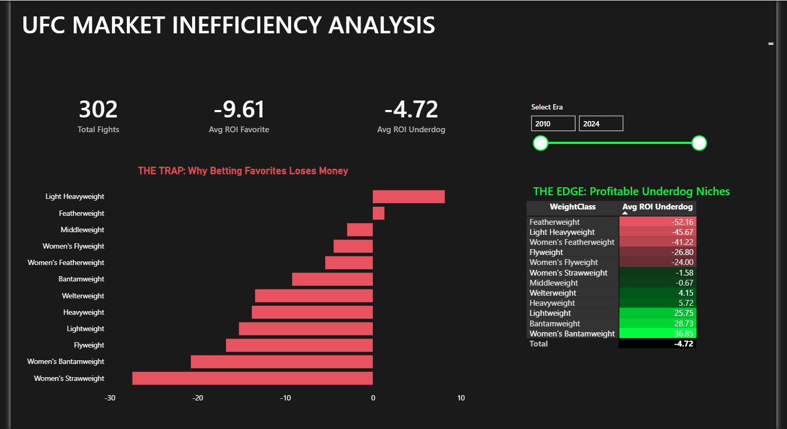

# UFC Market Inefficiency Analysis 🥊

## 📊 Project Overview
Sports betting markets are generally considered efficient, meaning "blind betting" (betting on every favorite or underdog) guarantees a loss due to the bookmaker's fee ("the vig").

This project analyzes 10+ years of UFC fight data to determine if statistically profitable strategies exist. By segmenting fights by Weight Class, Finish Method, and Stakes (Title vs. Non-Title), I identified a specific market inefficiency in Championship bouts.

## 🔍 Key Findings
* **The Trap:** Blindly betting on Favorites yields a **-9.6% ROI**.
* **The Myth:** Betting on "Knockouts" (Prop Bets) is statistically the worst strategy, with losses exceeding **-25%**.
* **The Edge:** Betting on Underdogs in **Bantamweight & Lightweight Title Fights** yields a positive ROI of **+28% to +36%**, contradicting the public sentiment that "Champions are safe bets."

## 🛠️ Tech Stack
* **Python (Pandas):** Data cleaning and transformation.
* **SQL (PostgreSQL):** Complex querying to calculate ROI across 5 different dimensions.
* **Power BI:** Interactive dashboard design with "Dark Mode" UI.

## 📈 Dashboard


## 💻 SQL Logic
The core analysis was performed using SQL to aggregate profitability metrics. You can view the full script in the `sql/` folder.

```sql
-- Example: Finding the "Gold Mine" (Query 6)
SELECT 
    "WeightClass",
    ROUND(AVG("Underdog_Profit")::numeric, 2) as ROI_Underdog_Champ
FROM fact_ufc_betting
WHERE "TitleBout" = 'true'
GROUP BY "WeightClass"
ORDER BY ROI_Underdog_Champ DESC;
